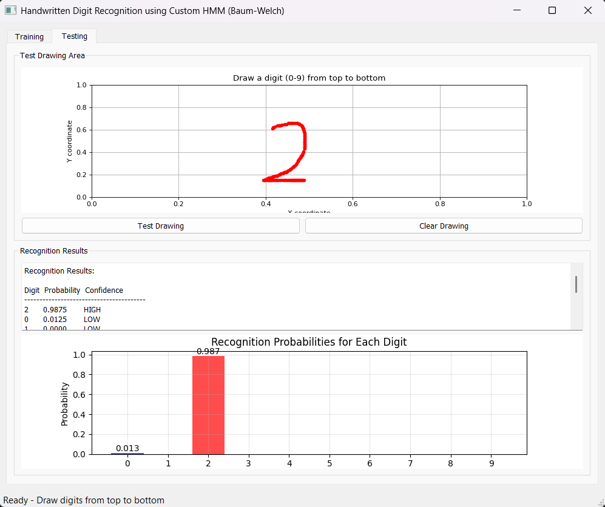
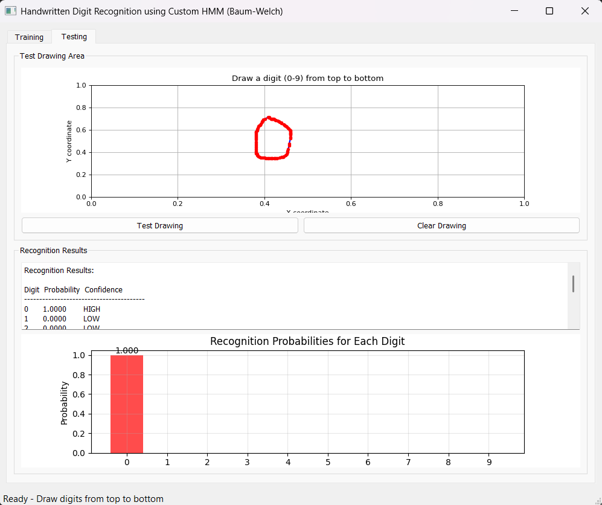

# Online handwritten recognition with hidden markov model (HMM)
## Idea
There are many applications that use online handwritten conversion to a digital form that computers can understand. such as mathematical formulas in Microsoft Word.

To keep the idea simple, our domain will be number from 0 to 9, and you can convert a single digit at a time; it can be enhanced in the future to capture English or Arabic letters, word, and sentences.

The application uses baum-welch for training models, and all models and idea are implemented from scratch as part of stochastic processes college course.

***A full math explanation of the idea is in `media/report.pdf`***

## Data
We will create our HMM dataset (From the training tab in the application). Each number is presented as a list of (x,y) points. All these points fall into the line drawn that number. And the data is stored in JSON format. It can be used to fine-tune the HMM model with the Baum-Welch algorithm.

## Output
Firstly, we train our model on our dataset, and we can save both the model and the dataset to use later. 

Then you draw a single number from 0 to 9, and the model will show the probabilities to be any number of 0 to 9 and highlight the highest probability as the expected number.

<div style="display: flex; justify-content: space-evenly">
  
  
</div>

<div style="text-align: center; margin-top: 5px">
  Output of testing phase on number 0 and 2
</div>

## Instructions to try the code
1. Clone this repository:

```powershell
git clone https://github.com/yahia997/Online-handwritten-recognition-with-HMM.git
cd Online-handwritten-recognition-with-HMM
```

2. Then run the `app.py` file (You must have python installed with required libraries).
3. Chose the trained model <strong>(slightly trained on 0, 1, and 2)</strong> on `models/final_model.pkl`, and go on test tab and try.
4. You can train on other numbers or enahnce the uploaded model, ensure to save your data and the model you will train.